# Hawaii Climate Analysis

  

---

## Summary ##

Hawaii is well-known for having a perfect combination of beautiful beaches and warm tropical weather year-round, making it a popular travel destination. But how exactly does weather fluctuate in terms of montly precipitation and temperature? This project performed climate analysis and data exploration of a Hawaii SQLite climate database using Python and SQLAlchemy through SQLAlchemy ORM queries, Pandas, and Matplotlib. Additionally, hypothetical vacation dates were chosen and the climate was analyzed for the timespan in order to demonstrate how the dataset could be utilized to help with trip planning.

---

## Process ##

### Reflect Tables Into SQLAlchemy ORM
* Used SQLAlchemy `create_engine` to connect to the sqlite database.
* Used SQLAlchemy `automap_base()` to reflect the tables into classes and save a reference to those classes called `Station` and `Measurement`.

### Exploratory Climate Analysis

#### 1. Precipitation Analysis
Designed a query to retrieve the last 12 months of precipitation data and plotted the results.
* Calculated the date one year from the last date in the data set.
* Designed a query to retrieve `date` and `prcp` values.
* Loaded the query results into a Pandas DataFrame and set the index to the date column.
* Sorted the DataFrame values by `date`.
* Plotted the results using the DataFrame `.plot` method.
* Used Pandas to print the summary statistics for the precipitation data.

  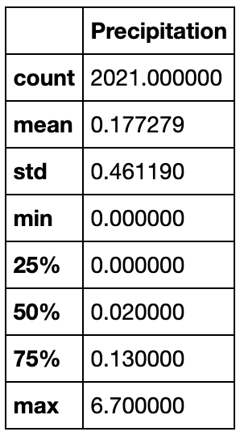
  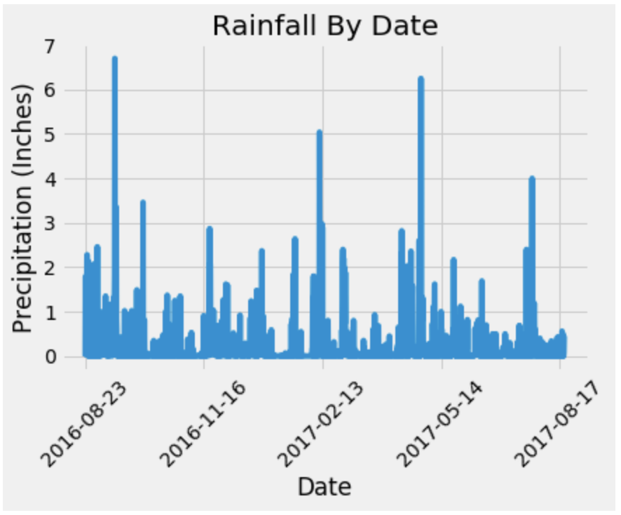

#### 2. Station Analysis
Designed a query to calculate the total number of stations and most active stations.
* Listed the stations and observation counts in descending order using the `func.count` function in queries..

  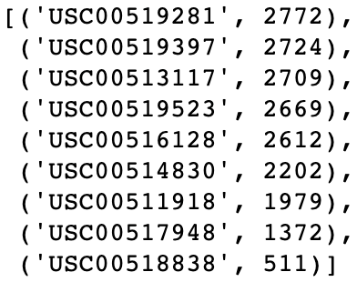

* Determined the top station's minimum, average, and maximum rainfall using `func.min`, `func.avg`, and `func.max` functions. 

  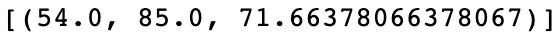

* Designed a query to retrieve the last 12 months of temperature observations (TOBS).
  * Filtered by the station with the highest number of observations.
  * Ploted the results as a histogram with `bins=12`.

  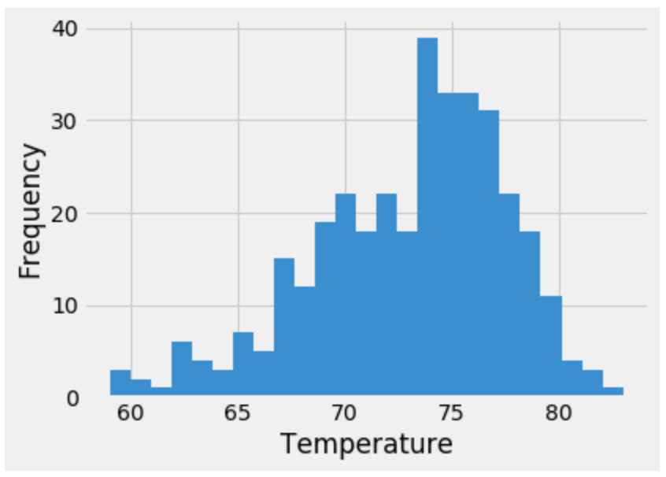

### Temperature Analysis

#### 1. June vs. December Temperature Differences

Queried all of the temperature observations made by the stations for all months of June and December to see if there is a meaningful difference in weather between summer and winter.
* Used Pandas's `read_csv()` function to read the CSV into a DataFrame.
* Filtered the DataFrame separately for the months of June and December.
* Identified the overall average temperature in June and December.

  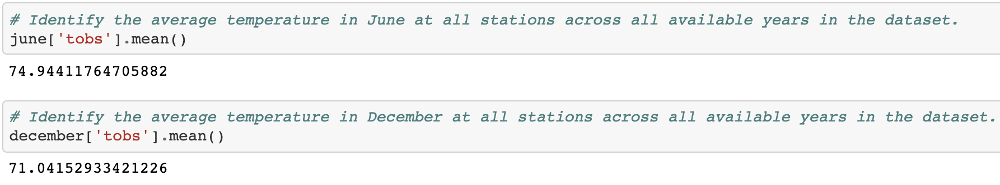

* Performed an independent t-test to determine whether the difference in the temperature means, is statistically significant.

  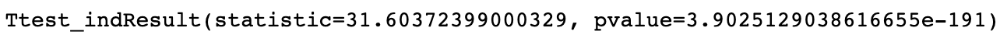

* Analyzed the t-statistic and p-value.
  * An independent-samples (unpaired) t-test was run since temperature observations for two different groups of cases, ie June versus December, are being compared. Though the average overall temperature difference between June and December was only 3.9 degrees Fahreinheit, the independent-samples t-test found an extremely low p-value, which strongly indicates statistical significance in the difference between the mean temperatures.

#### 2. Hypothetical Vacation Planning
##### Temperature Analysis
Vacation dates from 2015-10-14 until 2015-10-22 were chosen to be analyzed.
* Created a function that returns the minimum, average, and maximum, temperature for the chosen range of dates, using a date format of `%Y-%m-%d`.
* Used the function to calculate the min, max, and avg temperatures for the trip using the matching dates from the previous year.

  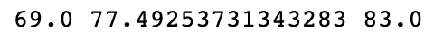

* Plotted the min, avg, and max temperature as a bar chart.
  * Used the average temperature as the bar height.
  * Used the peak-to-peak (TMAX-TMIN) value as the y-error bar (YERR).

  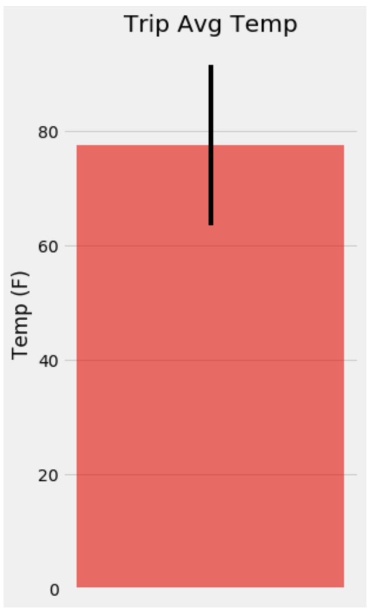

    
##### Average Daily Rainfall Analysis
The rainfall statistics for the vacation dates was analyzed.
* Calculated the total rainfall per weather station for the trip using the previous year's matching dates.
* Calculated the daily normals. Normals are the averages for the min, avg, and max temperatures.
  * Created a function to calculate the daily normals for the vacation dates, using a date string in the format `%m-%d`, pulling all historic TOBS that match the date string.
  * Created a `for` loop to go through the list of date strings and calculate the daily normals for each date and append the results to a list.
* Loaded the list of daily normals into a Pandas DataFrame and set the index equal to the date.

  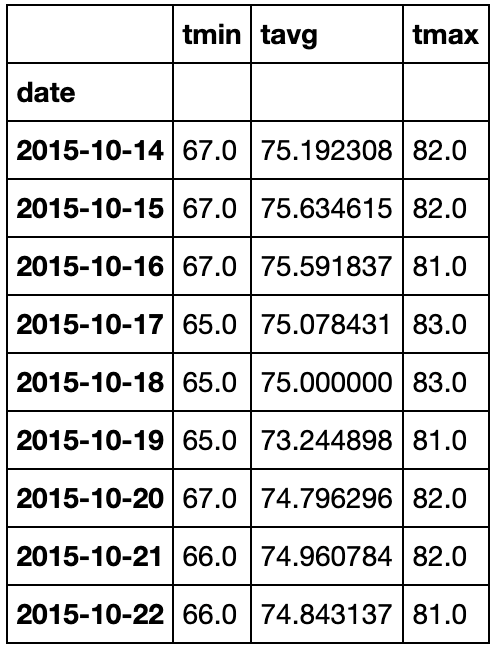

* Used Matplotlib to plot an area plot (`stacked=False`) for the daily normals.

  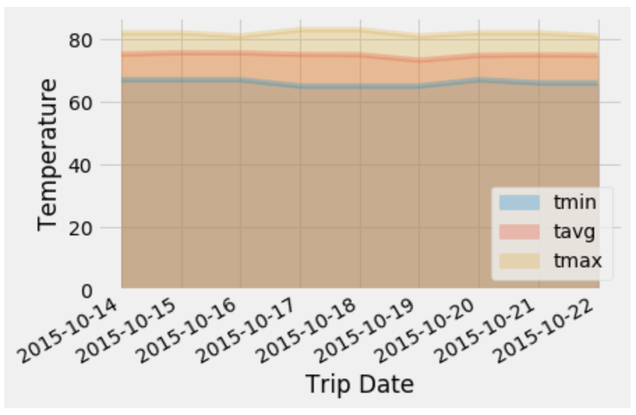

---

## Climate App ##
A Flask API was designed based on the queries developed, using Flask `jsonify` to convert API data into a valid JSON response object. The following routes were created using Flask. 

### Routes

* `/`
  * Home page.\
  * List all routes that are available.
* `/api/v1.0/precipitation`
  * Convert the query results to a dictionary using `date` as the key and `prcp` as the value.
  * Return the JSON representation of the dictionary.
* `/api/v1.0/stations`
  * Return a JSON list of stations from the dataset.
* `/api/v1.0/tobs`
  * Query the dates and temperature observations of the most active station for the last year of data.  
  * Return a JSON list of temperature observations (TOBS) for the previous year.
* `/api/v1.0/<start>` and `/api/v1.0/<start>/<end>`
  * Returned a JSON list of the minimum temperature, the average temperature, and the max temperature for a given start or start-end range.
  * When given the start only, calculate `TMIN`, `TAVG`, and `TMAX` for all dates greater than and equal to the start date.
  * When given the start and the end date, calculate the `TMIN`, `TAVG`, and `TMAX` for dates between the start and end date inclusive.

---

## Data Sources ##
* [Hawaii SQLite File](https://github.com/kiranrangaraj/sqlalchemy-challenge/blob/master/Resources/hawaii.sqlite)
* [Station Data](https://github.com/kiranrangaraj/sqlalchemy-challenge/blob/master/Resources/hawaii_stations.csv)
* [Measurement Data](https://github.com/kiranrangaraj/sqlalchemy-challenge/blob/master/Resources/hawaii_measurements.csv)

---

## Technologies Used ##
* PyCharm - Python IDE
* Jupyter Notebook
* Python - Pandas, SQLAlchemy, Flask, Datetime, NumPy, SciPy, Matplotlib
* SQLite, JSON, CSV files

---
## Author ##
Kiran Rangaraj - LinkedIn: [@Kiran Rangaraj](https://www.linkedin.com/in/kiranrangaraj/)
